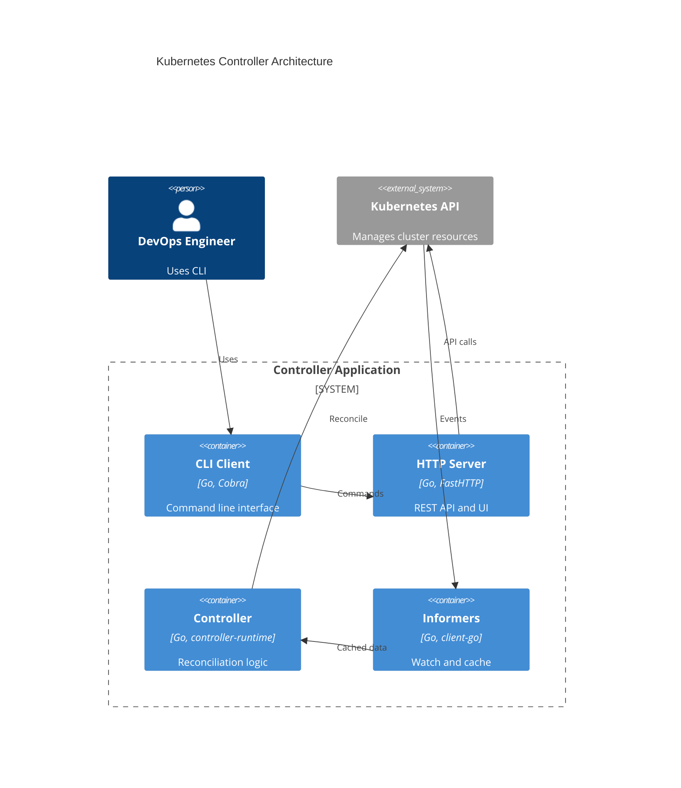

# Kubernetes Controller

My implementation of the Golang Kubernetes Controller course from FWDays.

## About

This project follows [the step-by-step tutorial](https://github.com/den-vasyliev/k8s-controller-tutorial-ref) for building production-grade Kubernetes controllers in Go. Each step is implemented as a separate commit/branch with detailed explanations.

**Course**: [Crash Course: Kubernetes controllers](https://fwdays.com/event/kubernetes-controllers-course)
**Instructors**: @den-vasyliev (Principal SRE), @Alex0M (Senior Platform Engineer)

## Progress

- [x] Golang CLI Application using Cobra
- [ ] Zerolog for structured logging
- [ ] pflag for CLI log level flags
- [ ] FastHTTP server command
- [ ] Makefile, Dockerfile, GitHub Workflow
- [ ] List Kubernetes Deployments with client-go
- [ ] Deployment Informer with client-go
- [ ] JSON API Endpoint for deployments
- [ ] controller-runtime Deployment Controller
- [ ] Leader Election and Metrics
- [ ] Custom Resource (FrontendPage CRD)
- [ ] Platform API (CRUD + Swagger)
- [ ] MCP Integration
- [ ] JWT Authentication
- [ ] OpenTelemetry Instrumentation

## Architecture



## Quick Start

```bash
# Clone and setup
git clone https://github.com/Searge/k8s-controller.git
cd k8s-controller
go mod download

# Build and run
go build -o bin/controller main.go
./bin/controller --help
```

## Dependencies

- **CLI**: cobra, pflag, zerolog
- **HTTP**: fasthttp
- **Kubernetes**: client-go, controller-runtime
- **Observability**: OpenTelemetry, Prometheus metrics
- **Auth**: JWT tokens
- **Build**: Docker, GitHub Actions
