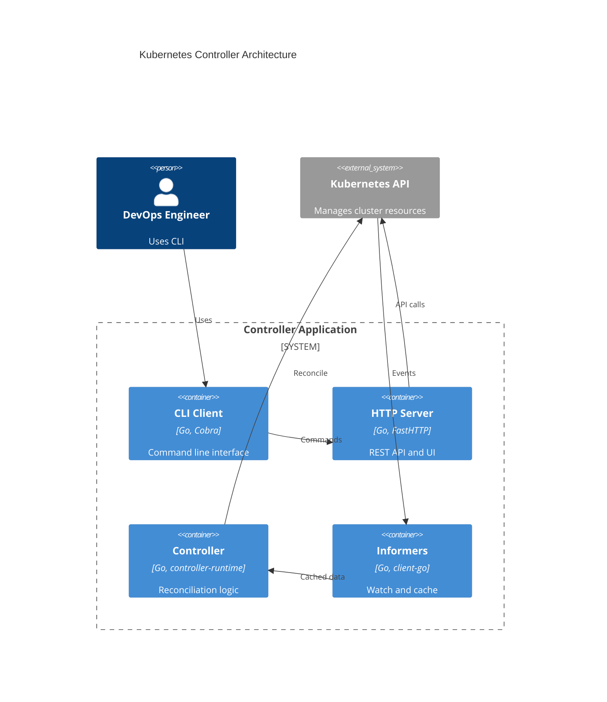

# Kubernetes Controller

My implementation of the Golang Kubernetes Controller course from FWDays.


[](https://pkg.go.dev/github.com/Searge/k8s-controller)
[](https://github.com/Searge/k8s-controller/actions/workflows/go.yml)

[](https://github.com/Searge/k8s-controller/commits/main/)

## About

This project follows [the step-by-step tutorial](https://github.com/den-vasyliev/k8s-controller-tutorial-ref) for building production-grade Kubernetes controllers in Go. Each step is implemented as a separate commit/branch with detailed explanations.

**Course**: [Crash Course: Kubernetes controllers](https://fwdays.com/event/kubernetes-controllers-course)
**Instructors**: @den-vasyliev (Principal SRE), @Alex0M (Senior Platform Engineer)

## Quick Start

### One-Command Setup

Get a complete Kubernetes development environment running in seconds:

```bash
# Clone the repository
git clone https://github.com/Searge/k8s-controller.git
cd k8s-controller

# Initialize Podman machine and provision Kubernetes cluster
task init && task ssh -- 'cd /srv/app && go-task provision'

# Access your cluster
task ssh
kubectl get nodes
kubectl get all -A
```

This automated setup creates:

- Podman machine with Fedora CoreOS
- Complete single-node Kubernetes cluster (v1.30.0)
- All control plane components (etcd, API server, scheduler, controller-manager)
- Kubelet with containerd runtime
- CNI networking with bridge plugin
- PKI infrastructure with auto-generated certificates

## Development Environment

The project includes a fully automated Kubernetes cluster setup for realistic controller development and testing. See [ansible/README.md](ansible/README.md) for detailed information about:

- Automated cluster provisioning
- Component configuration
- Available Ansible tags for selective deployment
- Troubleshooting and logging

### Available Tasks

The project uses [Taskfile](https://taskfile.dev/) for task automation:

```bash
# View all available tasks
task

# Development workflow
task dev          # Format, lint, test, build
task test-watch   # Run tests in watch mode
task docker-build # Build Docker image

# Environment management
task init         # Create and setup Podman machine
task ssh          # SSH into the machine
task provision    # Run Ansible provisioning
task reboot       # Restart the machine
task rm           # Remove the machine
```

## Progress

- [x] Golang CLI Application using Cobra
- [x] Automated Kubernetes cluster setup with Ansible
- [x] Podman machine integration with volume mounts
- [x] Complete PKI infrastructure with certificate generation
- [x] Taskfile automation for development workflow
- [ ] Zerolog for structured logging
- [ ] pflag for CLI log level flags
- [ ] FastHTTP server command
- [ ] Makefile, Dockerfile, GitHub Workflow
- [ ] List Kubernetes Deployments with client-go
- [ ] Deployment Informer with client-go
- [ ] JSON API Endpoint for deployments
- [ ] controller-runtime Deployment Controller
- [ ] Leader Election and Metrics
- [ ] Custom Resource (FrontendPage CRD)
- [ ] Platform API (CRUD + Swagger)
- [ ] MCP Integration
- [ ] JWT Authentication
- [ ] OpenTelemetry Instrumentation

## Architecture



## Project Structure

```bash
├── ansible/              # Kubernetes cluster automation
│   ├── README.md         # Detailed Ansible documentation
│   ├── init.yml          # Initial system setup
│   ├── provision.yml     # Main K8s provisioning
│   └── templates/        # Service and config templates
├── cmd/                  # CLI application code
├── notebooks/            # Go learning notebooks
├── scripts/              # Setup and utility scripts
├── Taskfile.yaml        # Task automation
├── Dockerfile           # Container image definition
└── README.md            # This file
```

## Dependencies

- **CLI**: cobra, pflag, zerolog
- **HTTP**: fasthttp
- **Kubernetes**: client-go, controller-runtime
- **Infrastructure**: Podman, Ansible, Taskfile
- **Observability**: OpenTelemetry, Prometheus metrics
- **Auth**: JWT tokens
- **Build**: Docker, GitHub Actions
