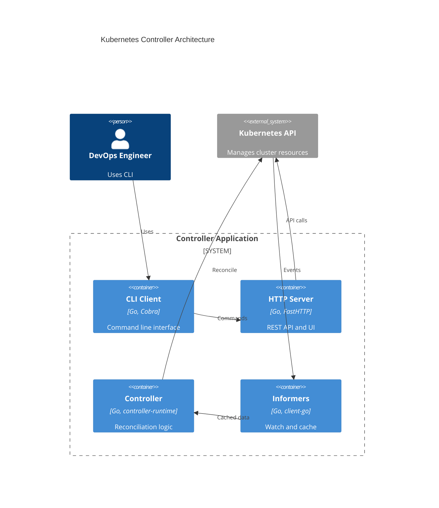

# Kubernetes Controller

My implementation of the Golang Kubernetes Controller course from FWDays.


[](https://pkg.go.dev/github.com/Searge/k8s-controller)
[](https://github.com/Searge/k8s-controller/actions/workflows/go.yml)

[](https://github.com/Searge/k8s-controller/commits/main/)

## About

This project follows [the step-by-step tutorial](https://github.com/den-vasyliev/k8s-controller-tutorial-ref) for building production-grade Kubernetes controllers in Go. Each step is implemented as a separate commit/branch with detailed explanations.

**Course**: [Crash Course: Kubernetes controllers](https://fwdays.com/event/kubernetes-controllers-course)
**Instructors**: @den-vasyliev (Principal SRE), @Alex0M (Senior Platform Engineer)

## Quick Start

### Prerequisites

- **Go 1.23.1+** - [Installation guide](https://golang.org/doc/install)
- **Taskfile** - [Installation guide](https://taskfile.dev/installation/)
- **Podman** - [Installation guide](https://podman.io/getting-started/installation)
- **Docker** (optional) - Alternative to Podman

Nothing installed locally? Use
[Dev Container / Codespaces](#dev-container--codespaces) instead.

### One-Command Setup

Get a complete Kubernetes development environment running in seconds:

```bash
# Clone the repository
git clone https://github.com/Searge/k8s-controller.git
cd k8s-controller

# Initialize Podman machine and provision Kubernetes cluster
task init && task ssh -- 'cd /srv/app && go-task provision'

# Access your cluster
task ssh
kubectl get nodes
kubectl get all -A
```

This automated setup creates:

- Podman machine with Fedora CoreOS
- Complete single-node Kubernetes cluster (v1.30.0)
- All control plane components (etcd, API server, scheduler, controller-manager)
- Kubelet with containerd runtime
- CNI networking with bridge plugin
- PKI infrastructure with auto-generated certificates

### Dev Container / Codespaces

The same cluster runs inside a Dev Container, so no Podman machine is needed.
Open the repository in VS Code (*Reopen in Container*) or in
[GitHub Codespaces](https://github.com/features/codespaces), then:

```bash
# Install etcd, kube-apiserver, kubelet, containerd, runc and CNI plugins
task devcontainer

# Generate PKI, render the unit files and start every component
task devcontainer-run

# Use the cluster
kubectl get nodes
kubectl get all -A
```

Two helpers are placed in the container home directory:

```bash
~/k8s-status.sh   # state of every component
~/k8s-stop.sh     # stop the control plane
```

Both playbooks read the same `ansible/group_vars/all.yml` as `provision.yml`,
so versions, CIDRs and paths match the Podman/Docker environment.

## Development Environment

The project includes a fully automated Kubernetes cluster setup for realistic controller development and testing. See [ansible/README.md](ansible/README.md) for detailed information about:

- Automated cluster provisioning
- Component configuration
- Available Ansible tags for selective deployment
- Troubleshooting and logging

### Available Tasks

The project uses [Taskfile](https://taskfile.dev/) for task automation:

```bash
# View all available tasks
task

# Development workflow
task dev          # Format, lint, test, build
task test-watch   # Run tests in watch mode
task docker-build # Build Docker image

# Environment management
task init         # Create and setup Podman machine
task ssh          # SSH into the machine
task provision    # Run Ansible provisioning
task reboot       # Restart the machine
task rm           # Remove the machine

# Dev Container / Codespaces
task devcontainer     # Install K8s components into the devcontainer
task devcontainer-run # Start the control plane inside the devcontainer
```

## Progress

- [x] **Foundation**
  - [x] Golang CLI Application using Cobra
  - [x] Structured logging with zerolog
  - [x] HTTP server with FastHTTP
  - [x] Comprehensive testing suite
  - [x] Quality assurance with linters
  - [x] Development environment automation
  - [x] Documentation and examples

- [ ] **Kubernetes Integration** (In Progress)
  - [x] List Kubernetes Deployments with client-go
  - [ ] Deployment Informer with client-go
  - [ ] JSON API Endpoint for deployments
  - [ ] controller-runtime Deployment Controller
  - [ ] Leader Election and Metrics

- [ ] **Advanced Features** (Future)
  - [ ] Custom Resource (FrontendPage CRD)
  - [ ] Platform API (CRUD + Swagger)
  - [ ] JWT Authentication
  - [ ] OpenTelemetry Instrumentation
  - [ ] Helm Charts and GitOps

## Architecture


```mermaid
C4Container
    title Kubernetes Controller Architecture

    Person(user, "DevOps Engineer", "Uses CLI")

    System_Boundary(app, "Controller Application") {
        Container(cli, "CLI Client", "Go, Cobra", "Command line interface")
        Container(server, "HTTP Server", "Go, FastHTTP", "REST API and UI")
        Container(controller, "Controller", "Go, controller-runtime", "Reconciliation logic")
        Container(informers, "Informers", "Go, client-go", "Watch and cache")
    }

    System_Ext(k8s, "Kubernetes API", "Manages cluster resources")

    Rel(user, cli, "Uses")
    Rel(cli, server, "Commands")
    Rel(server, k8s, "API calls")
    Rel(k8s, informers, "Events")
    Rel(informers, controller, "Cached data")
    Rel(controller, k8s, "Reconcile")
```

## Project Structure

```bash
├── .devcontainer/            # Dev Container / Codespaces definition
├── ansible/                  # Kubernetes cluster automation
│   ├── README.md             # Detailed Ansible documentation
│   ├── group_vars/           # Shared vars: versions, CIDRs, paths
│   ├── init.yml              # Initial system setup
│   ├── provision.yml         # Main K8s provisioning (Podman VM)
│   ├── devcontainer.yml      # Install K8s into a devcontainer
│   ├── devcontainer-run.yml  # Run K8s inside a devcontainer
│   └── templates/            # Service and config templates
├── cmd/                      # CLI application code
├── notebooks/                # Go learning notebooks
├── scripts/                  # Setup and utility scripts
├── Taskfile.yaml             # Task automation
├── Dockerfile                # Container image definition
└── README.md                 # This file
```

## 📚 Documentation

- **[API Documentation](docs/api.md)** - HTTP endpoints and CLI commands

## 🔗 Resources

- **Course**: [Kubernetes Controllers Crash Course](https://fwdays.com/event/kubernetes-controllers-course)
- **Reference**: [Tutorial Reference Implementation](https://github.com/den-vasyliev/k8s-controller-tutorial-ref)
- **Go Style**: [Google Go Style Guide](https://google.github.io/styleguide/go/guide)
- **Kubernetes**: [client-go Documentation](https://pkg.go.dev/k8s.io/client-go)

## 📄 License

This project is licensed under the GNU General Public License v3.0 - see the [LICENSE](LICENSE) file for details.

**Built with ❤️ by [@Searge](https://github.com/Searge)**
