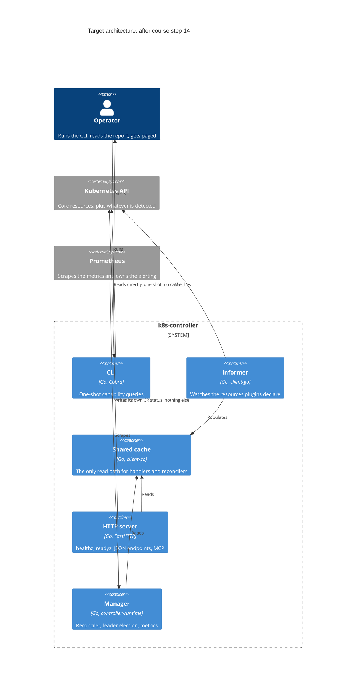

# Architecture

What exists today, what it will become, and why the boundaries fall where they do. Kept honest
about the gap between the two — the target layout below is not what is on disk.

## Today

```text
main.go                    calls cmd.Execute()
cmd/
  root.go                  Cobra root, --log-level, logger init
  flags.go                 package-level flag variables shared across commands
  list.go                  `list deployments` via a live API call
  serve.go                 `serve`: root signal context, informer and server via errgroup
  connection.go            connection test command
  version.go               `version`
pkg/
  k8s/client.go            client-go wrapper: kubeconfig loading, clientset, projection
  logger/logger.go         zerolog init, and the klog bridge for client-go's own logging
  server/server.go         listener lifecycle: New(port, source, logger), Start(ctx)
  server/handlers.go       routing, /healthz, /readyz, /deployments, request ids
internal/
  informer/informer.go     cached Deployment watcher: factory, sync gating, lifetime
  informer/handlers.go     event handlers and counters
```

Supporting directories — `ansible/`, `scripts/`, `notebooks/`, `.devcontainer/` — are development
and provisioning tooling, described in [the top-level README](../README.md) and frozen per
decision 013.

### Current data flow

```text
user   -> cmd list  -> pkg/k8s.Client -> clientset -> Kubernetes API
                                           (one List call per invocation)

signal -> cmd serve -> root context
                          |
                          +-> internal/informer -> cache <- watch -> Kubernetes API
                          |                          ^
                          +-> pkg/server ------------+  handlers read the cache only
```

Two read paths coexist on purpose. `list` is the course's step 6 and still calls the API directly.
`serve` is steps 7 and 8: the informer watches once and the handlers answer from the cache, which
is why a request costs the API server nothing and returns in well under a millisecond.

The server has no clientset to reach for — it takes a `DeploymentSource` interface — so "answers
come from the cache" is a property of the types rather than a rule someone has to remember.

## Where it is going



The single structural change that unlocks the rest: a root context owned by `serve`, with the
HTTP server and every long-running component started under it and shut down when it is cancelled.
This landed in step 7: `Start(ctx)` serves until cancellation and returns only once the serve
goroutine has stopped, which is what lets the informer and the server share one signal.

## Package boundaries

| Package | Owns | Must not |
| --- | --- | --- |
| `cmd/` | Flag definitions, input validation, output formatting | Contain domain logic, or be the only place a value can be configured from |
| `internal/plugin` | Capability implementations and their API-group requirements | Talk to Cobra, or reach for package-level globals |
| `internal/informer` | Shared informer factory, cache-sync gating | Serve HTTP, or own the process lifecycle |
| `internal/controller` | Reconcilers, custom resource types | Read live from the API where the cache would do |
| `pkg/k8s` | Kubeconfig resolution, typed and dynamic client construction | Know about any particular capability or domain |
| `pkg/server` | HTTP routing, request logging, lifecycle | Call the Kubernetes API directly |
| `pkg/logger` | zerolog configuration | Anything else |

`internal/` rather than `pkg/` for new code: the application has no external importers, so `pkg/`
would be promising API stability to nobody. Existing packages move as steps touch them, per
decision 012. See [005](decisions/005-internal-for-app-code-pkg-for-reusable.md).

### One rule worth stating separately

Domain packages take dependencies as arguments — a logger, a client interface, a context — and
never read Cobra flag variables. That is what lets a capability be tested with plain table-driven
tests and no fake clientset: its core is a function from a snapshot of input objects to an answer.
The deployment projection is the existing example -- `k8s.NewDeploymentInfo` takes the current time
as a parameter, so no test needs a clock.

## Testing strategy per layer

| Layer | How it is tested |
| --- | --- |
| Pure capability logic (joins, classification, policy comparison) | Table-driven tests over hand-built input structs. No cluster, no fakes, no clock — the current time is a parameter |
| Client-go access | `k8s.io/client-go/kubernetes/fake` for typed reads, `dynamic/fake` for custom resources |
| Informer | A fake watch driving add, update and delete; assertions read the cache, not the watch |
| HTTP handlers | A handler test that fails if the handler reaches for a clientset instead of the cache |
| Reconciler | `envtest` — a real API server, with the awkward cases as fixtures: an absent API group, an unknown plugin name, a status update that loses a conflict |
| Lifecycle | Cancel the root context; assert the informer and the server both stop and neither leaks |

Coverage percentage is not a goal. Each step ends with a test that would fail if the behaviour
regressed, and in practice that claim is checked by mutation: break the behaviour on purpose and
confirm the suite notices. Doing so has already found two real bugs that passing tests had missed.

## Deployment shape

Not built yet; recorded so the steps aim at something.

- One Deployment, two replicas, leader election through the manager. Only the leader reconciles.
- A ServiceAccount with a Role granting reads on exactly what the enabled plugins declare, write
  access to nothing but its own custom resource status, and `create` on `tokenreviews` for caller
  authentication (decision 024).
- `/healthz` and `/readyz` wired to the manager, with readiness gated on cache sync.
- A metrics endpoint scraped by Prometheus, and an example `PrometheusRule` shipped alongside
  rather than any built-in notification path (decision 004).

## Upstream reference

- [client-go](https://pkg.go.dev/k8s.io/client-go)
- [controller-runtime](https://pkg.go.dev/sigs.k8s.io/controller-runtime)
- [The Kubebuilder Book](https://book.kubebuilder.io/)
- [envtest](https://pkg.go.dev/sigs.k8s.io/controller-runtime/pkg/envtest)
