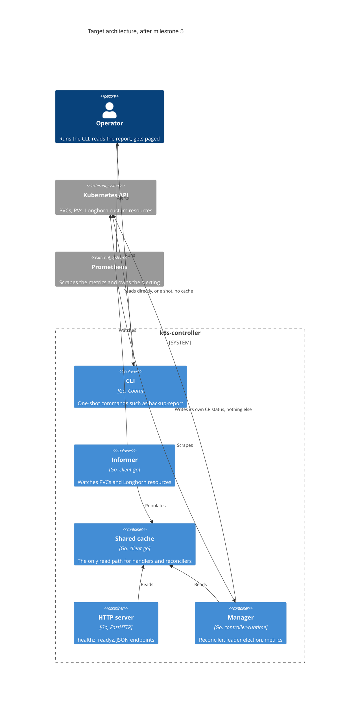

# Architecture

What exists today, what it will become, and why the boundaries fall where they do. Kept honest
about the gap between the two — the target layout below is not what is on disk.

## Today

```text
main.go                    calls cmd.Execute()
cmd/
  root.go                  Cobra root, --log-level, PersistentPreRun logger init
  flags.go                 package-level flag variables shared across commands
  list.go                  `list deployments`, output formatting, validation
  serve.go                 `serve`, port validation
  connection.go            connection test command
  version.go               `version`
pkg/
  k8s/client.go            client-go wrapper: kubeconfig loading, clientset, ListDeployments
  logger/logger.go         zerolog initialisation from a level string
  server/server.go         FastHTTP handler and Start(port, logger)
internal/
  backup/                  BackupCheck domain — milestone 1, in progress
```

Supporting directories — `ansible/`, `scripts/`, `notebooks/`, `.devcontainer/` — are development
and provisioning tooling, described in [the top-level README](../README.md) and frozen per
decision 013.

### Current data flow

```text
user -> cmd (Cobra) -> pkg/k8s.Client -> clientset -> Kubernetes API
                                                        (one List call per invocation)
user -> cmd serve -> pkg/server.Start -> fasthttp.ListenAndServe
                                           (blocks; no context, no shutdown)
```

Every read is a live API call. Nothing is cached, and nothing outlives a single command
invocation.

## Where it is going



The single structural change that unlocks the rest: a root context owned by `serve`, with the
HTTP server and every long-running component started under it and shut down when it is cancelled.
The current `Start(port, logger)` cannot host anything with a lifecycle, which is why milestone 2
changes it rather than a later cleanup pass doing so.

## Package boundaries

| Package | Owns | Must not |
| --- | --- | --- |
| `cmd/` | Flag definitions, input validation, output formatting | Contain domain logic, or be the only place a value can be configured from |
| `internal/backup` | The Longhorn object graph, the join, bucket classification | Talk to Cobra, or reach for package-level globals |
| `internal/informer` | Shared informer factory, cache-sync gating | Serve HTTP, or own the process lifecycle |
| `internal/controller` | Reconcilers, custom resource types | Read live from the API where the cache would do |
| `pkg/k8s` | Kubeconfig resolution, typed and dynamic client construction | Know about backups, probes, or any domain |
| `pkg/server` | HTTP routing, request logging, lifecycle | Call the Kubernetes API directly |
| `pkg/logger` | zerolog configuration | Anything else |

`internal/` rather than `pkg/` for new code: the application has no external importers, so `pkg/`
would be promising API stability to nobody. Existing packages move as milestones touch them, per
decision 012. See [DECISIONS.md](DECISIONS.md) 005.

### One rule worth stating separately

Domain packages take dependencies as arguments — a logger, a client interface, a context — and
never read Cobra flag variables. That is what makes the join logic in `internal/backup` testable
with plain table-driven tests and no fake clientset: its core is a function from a snapshot of
input objects to a report.

## Testing strategy per layer

| Layer | How it is tested |
| --- | --- |
| Pure domain logic (the join, bucket classification, policy comparison) | Table-driven tests over hand-built input structs. No cluster, no fakes, no clock — the current time is a parameter |
| Client-go access | `k8s.io/client-go/kubernetes/fake` for typed reads, `dynamic/fake` for custom resources |
| Informer | A fake watch driving add, update and delete; assertions read the cache, not the watch |
| HTTP handlers | A handler test that fails if the handler reaches for a clientset instead of the cache |
| Reconciler | `envtest` — a real API server, with the awkward cases from [backup-check.md](backup-check.md) as fixtures |
| Lifecycle | Cancel the root context; assert the informer and the server both stop and neither leaks |

Coverage percentage is not a goal. Decision 012's rule applies: each milestone ends with a test
that would fail if the behaviour regressed.

## Deployment shape

Not built yet; recorded so the milestones aim at something.

- One Deployment, two replicas, leader election through the manager. Only the leader reconciles.
- A ServiceAccount with a Role granting reads on exactly the resources listed in
  [backup-check.md](backup-check.md), and write access to nothing but its own custom resource
  status.
- `/healthz` and `/readyz` wired to the manager, with readiness gated on cache sync.
- A metrics endpoint scraped by Prometheus, and an example `PrometheusRule` shipped alongside
  rather than any built-in notification path (decision 004).

## Upstream reference

- [client-go](https://pkg.go.dev/k8s.io/client-go)
- [controller-runtime](https://pkg.go.dev/sigs.k8s.io/controller-runtime)
- [The Kubebuilder Book](https://book.kubebuilder.io/)
- [envtest](https://pkg.go.dev/sigs.k8s.io/controller-runtime/pkg/envtest)
